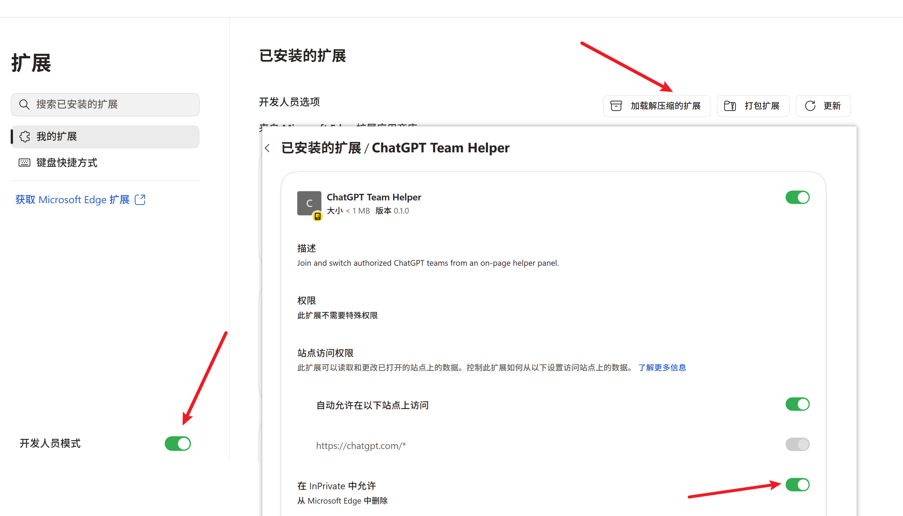
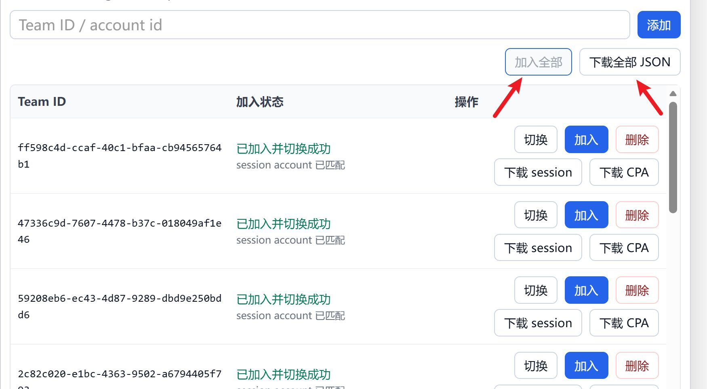

# 自动加入K12Team-浏览器插件

## 脚本特点

- 个人使用：只接受一次验证码，登录后一键执行。

- 本地运行：不依赖后端服务，下载文件只在本机生成。

- 批量导出：session 和 CPA JSON，并按 `session/`、`cpa/` 两个目录自动打包成 ZIP。

## 使用说明

- 地址栏输入 edge://extensions/

- 点击开发者模式，加载解压缩的扩展，选择该项目

- 找到 ChatGPT Team Helper，点「详细信息」拉到最底下，把「在 InPrivate 中允许」开关打开

- 使用隐私模式打开浏览器，用gamil子邮箱登录 https:// chatgpt.com 
- link+1@gmail.com(邮箱名+任意字符串)，子邮箱超过5个会注册失败

- 点击加入全部 ，自动加入team，全部加入后点击 下载全部JSON

